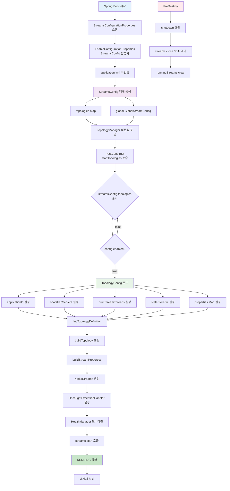
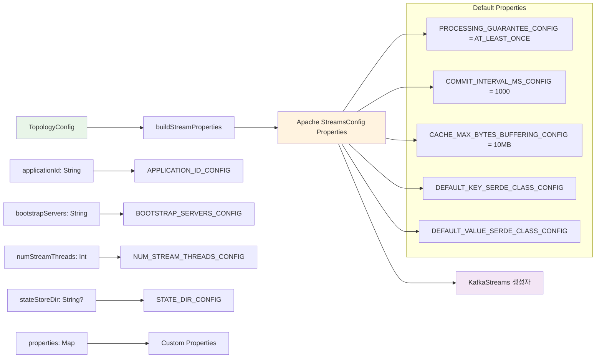
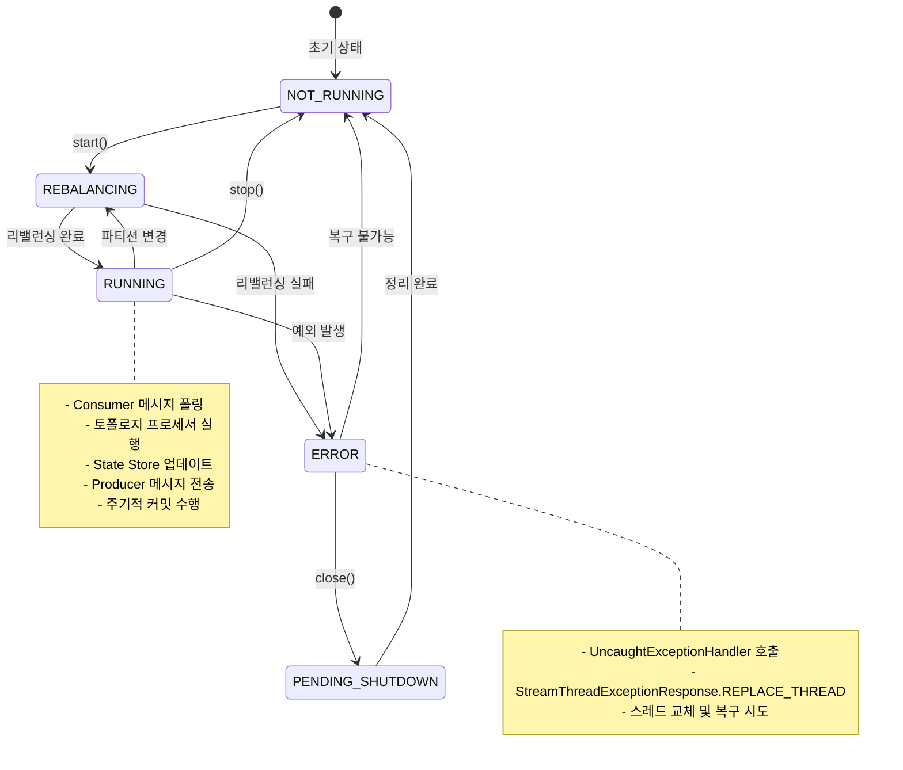

# Kafka Streams Multi-Module Project

Spring Boot 3.x + Kotlin + Kafka Streams를 사용한 멀티모듈 이벤트 스트리밍 애플리케이션

## 🏗️ 아키텍처

### 멀티모듈 구조 -> 나중에 토폴로지를 분리하여 인프라 실행 가능 하게 구성
- **streams-app**: 메인 애플리케이션 모듈 (공통 설정 및 실행)
- **order-processing**: 주문 처리 토폴로지 모듈
- **inventory-tracking**: 재고 추적 토폴로지 모듈

### 핵심 특징
- **모듈별 격리**: 각 토폴로지가 독립적인 모듈로 관리
- **공통 설정 공유**: CommonStreamsConfiguration을 통한 설정 통합

### 토폴로지 구성
1. **Order Processing**: 주문 이벤트 처리 및 상태별 분류
2. **Inventory Tracking**: 재고 변경 추적 및 알림 생성 (State Store 포함)

## 🚀 빠른 시작

### 1. Kafka 환경 설정
```bash
# Docker Compose로 Kafka 클러스터 시작
docker-compose up -d

# 토픽 생성
./scripts/kafka-setup.sh
```

### 2. 애플리케이션 실행
```bash
# 멀티모듈 애플리케이션 실행
./gradlew :modules:streams-app:bootRun

# 테스트 프로필로 실행
./gradlew :modules:streams-app:bootRun --args='--spring.profiles.active=test'
```

### 3. 상태 확인
```bash
# 모든 토폴로지 상태 확인
curl http://localhost:8080/admin/topologies

# Kafka UI: http://localhost:8090
# Actuator: http://localhost:8080/actuator
```

## 🧪 테스트

### 대화형 테스트 (권장)
```bash
# 대화형 메뉴로 메시지 전송
./scripts/produce-messages.sh

# 토폴로지 테스트 실행
./scripts/test-topology.sh
```

### 간단한 메시지 전송
```bash
# 주문 이벤트 전송
./scripts/produce-simple.sh orders '{"orderId":"ORDER-001","amount":1500.00}'

# 재고 업데이트 전송
./scripts/produce-simple.sh inventory-updates '{"productId":"PROD-001","quantity":10,"operation":"ADD","timestamp":"2024-01-01T00:00:00Z"}'
```

## ⚙️ 토폴로지 관리

```bash
# 토폴로지 상태 확인
curl http://localhost:8080/admin/topologies

# 토폴로지 중지/시작/재시작
curl -X POST http://localhost:8080/admin/topologies/order-processing/stop
curl -X POST http://localhost:8080/admin/topologies/order-processing/start
curl -X POST http://localhost:8080/admin/topologies/order-processing/restart
```

## ⚙️ Kafka Streams 라이프사이클

### StreamsConfig 실행 라이프사이클



### TopologyConfig → Properties 변환 과정



### Kafka Streams 상태 전환



## 📁 멀티모듈 프로젝트 구조

```
modules/
├── streams-app/                              # 메인 애플리케이션
│   ├── src/main/kotlin/com/example/kafka/streams/app/
│   │   ├── KafkaStreamsApplication.kt
│   │   └── config/
│   │       └── CommonStreamsConfiguration.kt # 공통 Kafka Streams 설정
│   └── src/main/resources/
│       └── application.yml                   # 통합 설정
├── order-processing/                         # 주문 처리 모듈
│   └── src/main/kotlin/com/example/kafka/streams/order/
│       ├── config/OrderProcessingAutoConfiguration.kt
│       ├── domain/                           # 주문 도메인
│       ├── infrastructure/kafka/JsonSerde.kt
│       └── topology/OrderProcessingTopology.kt
└── inventory-tracking/                       # 재고 추적 모듈
    └── src/main/kotlin/com/example/kafka/streams/inventory/
        ├── config/InventoryTrackingAutoConfiguration.kt
        ├── domain/                           # 재고 도메인
        ├── infrastructure/kafka/JsonSerde.kt
        └── topology/InventoryTrackingTopology.kt

scripts/
├── kafka-setup.sh                           # 토픽 생성
├── produce-messages.sh                      # 대화형 프로듀서
├── produce-simple.sh                        # 간단한 메시지 전송
└── test-topology.sh                         # 토폴로지 테스트
```

## 🔧 API 엔드포인트

```bash
GET    /admin/topologies              # 모든 토폴로지 상태
GET    /admin/topologies/{name}       # 특정 토폴로지 상태
POST   /admin/topologies/{name}/start # 토폴로지 시작
POST   /admin/topologies/{name}/stop  # 토폴로지 중지
POST   /admin/topologies/{name}/restart # 토폴로지 재시작
GET    /actuator/health               # 헬스 체크
```

## 📚 참고 자료

- [Kafka Streams Developer Guide](https://kafka.apache.org/documentation/streams/developer-guide/)
- [Spring Boot Kafka Documentation](https://docs.spring.io/spring-boot/docs/current/reference/html/messaging.html#messaging.kafka)
- [Confluent Kafka Streams Tutorial](https://kafka-tutorials.confluent.io/)
## 📋 개발 진행 상황

✅ **완료된 작업**
- [x] 멀티모듈 아키텍처 설정
- [x] Order Processing 모듈 구현 및 테스트
- [x] Inventory Tracking 모듈 구현 및 테스트  
- [x] Streams App 모듈 구현 및 테스트
- [x] 포괄적인 단위 테스트 (63개)
- [x] Docker Compose 설정
- [x] 프로덕션 준비 설정

🎯 **현재 상태**: 프로덕션 준비 완료

